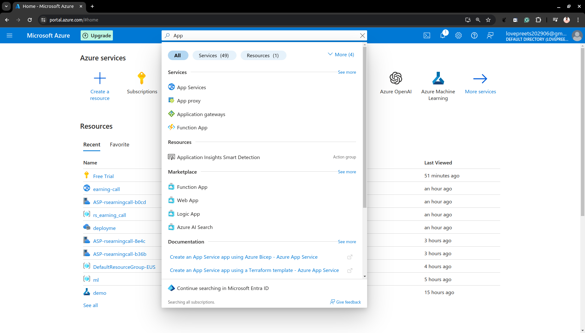
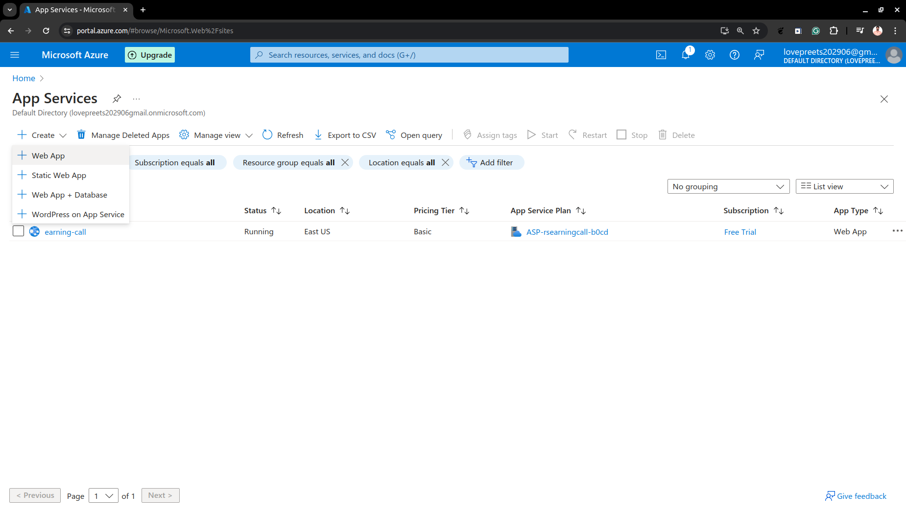
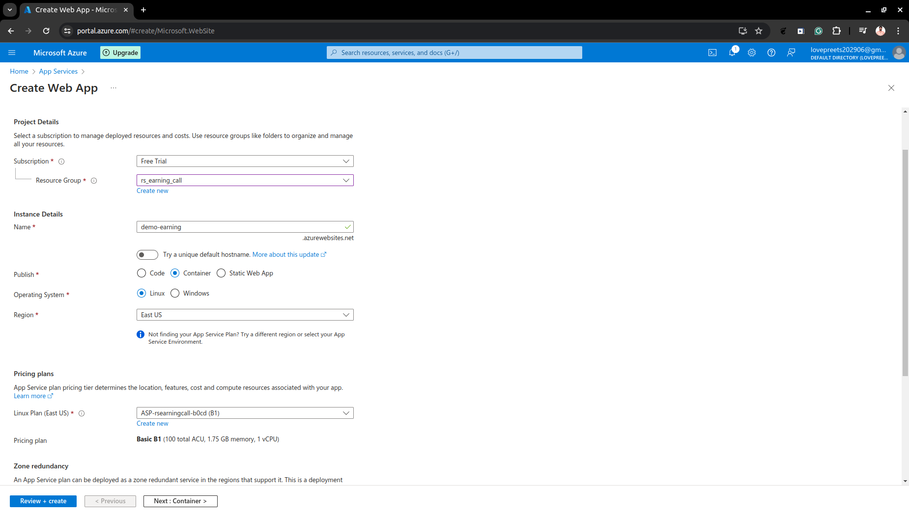
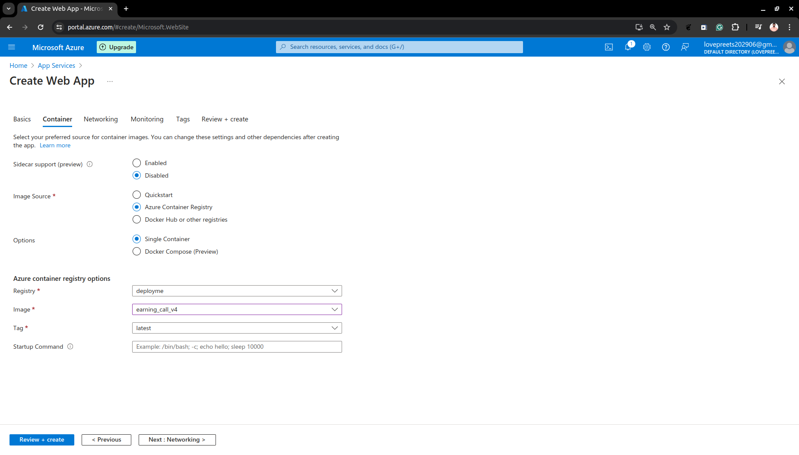
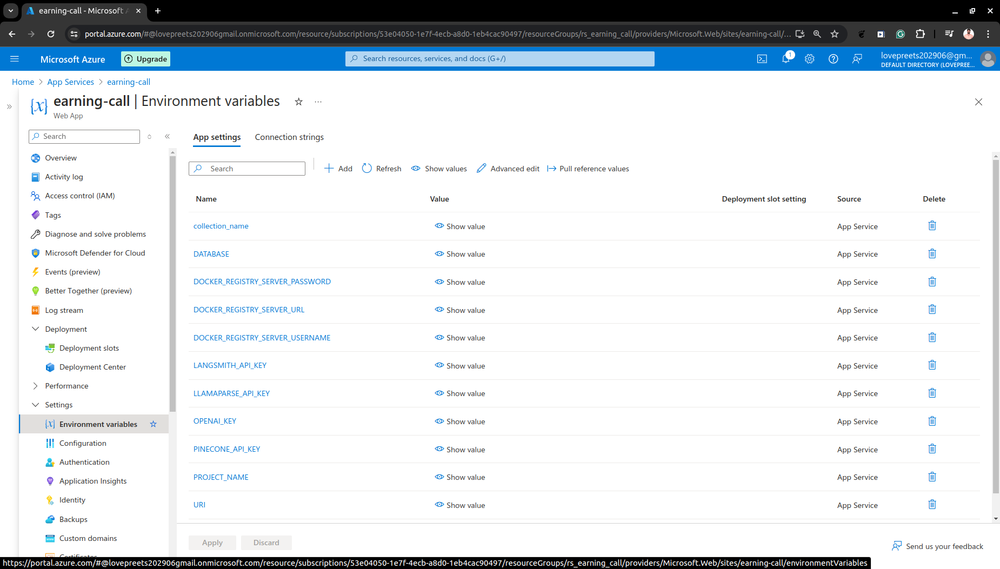
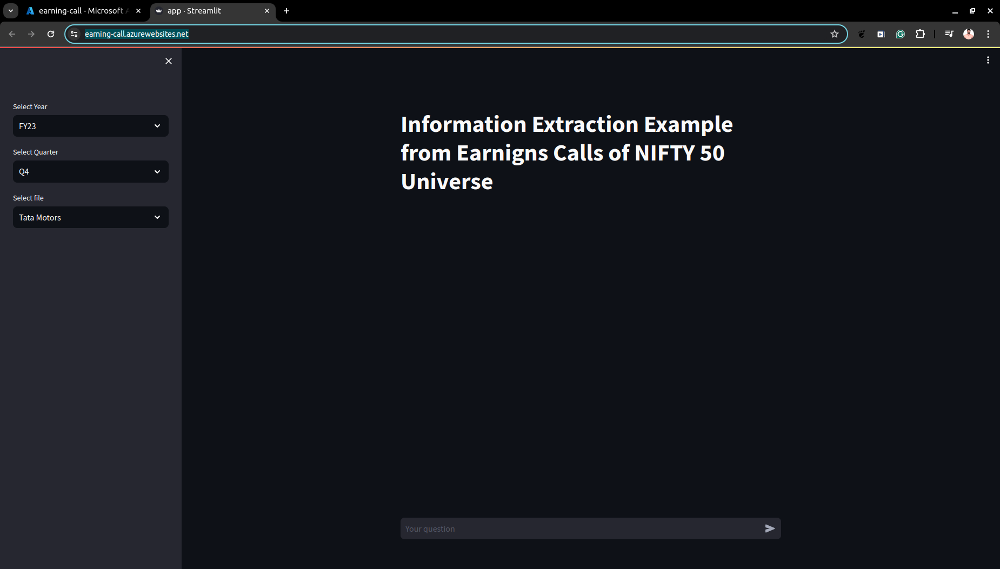

# azure-earning-call

## Project Outline

This project is a Retrieval Augmented Generation (RAG) application that leverages earnings call report documents of NIFTY 50 companies. The system allows users to select a company from a list and then ask questions about the earnings call reports. The backend is built with Python and the UI is developed using Streamlit. Environment variables are loaded from a .env file for configuration. The application is containerized using Docker and hosted on Azure App Service.

## Prerequisites

- Python 3.9+
- Docker
- Azure CLI (for deployment)

## Getting Started

### Cloning the Repository

To get a copy of the project up and running locally on your machine, clone the repository:

```bash
git clone https://github.com/Lovepreet-Singh-ACET/azure-earning-call.git
cd azure-earning-call
```

### Setting Up the Environment Variables

Create a `.env` file in the root directory of the project and add the necessary environment variables. Below is an example of what the `.env` file should look like:

```bash
# .env
URI="Your_MONGO_CONNECTION_URI"
DATABASE="YOUR_DATABASE_NAME"
COLLECTION_NAME="YOUR_COLLECTION_NAME"
LANGSMITH_API_KEY="YOUR_LANGSMITH_API_KEY"
PROJECT_NAME="LANGSMIT_PROJECT_NAME"
OPENAI_KEY="YOUR_OPENAI_KEY"
PINECONE_API_KEY="YOUR_PINECONE_KEY"
LLAMAPARSE_API_KEY="YOUR_LLAMAPARSE_API_KEY
```

Replace the placeholder values with your actual configuration.

### Installing Dependencies

Create and activate a virtual environment, then install the required dependencies:

```bash
python -m venv venv
source venv/bin/activate  # On Windows use `venv\Scripts\activate`
pip install -r requirements.txt
```

### Running the Application Locally

To run the application locally using Streamlit, use the following command:

```bash
streamlit run app.py
```

## Building and Running Docker Image Locally

### Building the Docker Image

To build the Docker image, run the following command in the root directory of the project where the `Dockerfile` is located:

```bash
docker build -t your-image-name .
```

### Running the Docker Container

To run the Docker container, use the following command:

```bash
docker run -d -p 80:80 --env-file .env your-image-name
```

This will start the container and map port 80 on your local machine to port 80 in the container, allowing you to access the Streamlit application at `http://localhost:80`.

## Deployment to Azure App Service

### Step 1: Login to Azure

First, login to your Azure account using the Azure CLI:

```bash
az login
```

### Step 2: Create a Resource Group

Create a resource group if you don't have one already:

```bash
az group create --name your-resource-group --location your-location
```

<!-- ### Step 3: Create an Azure App Service Plan

Create an App Service plan:

```bash
az appservice plan create --name your-app-service-plan --resource-group your-resource-group --sku B1
```

### Step 4: Create the Web App

Create the web app:

```bash
az webapp create --resource-group your-resource-group --plan your-app-service-plan --name your-webapp-name --deployment-container-image-name your-image-name
```

### Step 5: Configure Environment Variables

Configure the environment variables for the web app:

```bash
az webapp config appsettings set --resource-group your-resource-group --name your-webapp-name --settings @.env
``` -->

### Step 3: Push the Docker Image to Azure Container Registry

1. Create an ACR instance:

    ```bash
    az acr create --resource-group your-resource-group --name yourregistryname --sku Basic
    ```

2. Login to ACR:

    ```bash
    az acr login --name yourregistryname
    ```

3. Tag your Docker image:

    ```bash
    docker tag your-image-name yourregistryname.azurecr.io/your-image-name
    ```

4. Push the image to ACR:

    ```bash
    docker push yourregistryname.azurecr.io/your-image-name
    ```

### Step 4: Deploy the Docker Image from ACR to Azure App Service

Use Azure Portal for easy deployment

1. Go to https://portal.azure.com/ and search for App Services.




2. In App Services click `Create` and select `Web App`.



3. Choose the `resource group` created above, give a `unique name` to the application, and choose `container` in Publish, rest should be ok.



4. Click next to select the `container`, under Image Source select `Azure Container Registry` and then select the image that you want to deploy and click `Review + create` to start the container.



5. Once the Application is deployed and you land on the Overview page, click on `Settings` on the left pannel and click on `Environment variables` and add the enviornment variable.



6. All done now you can access the Web App.

